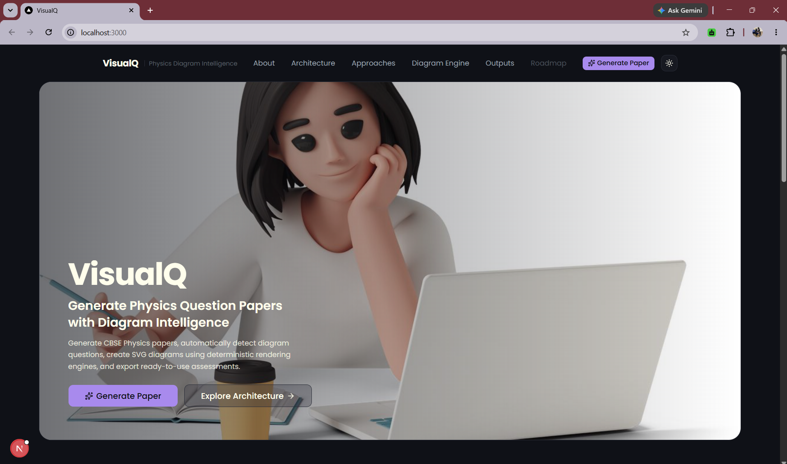
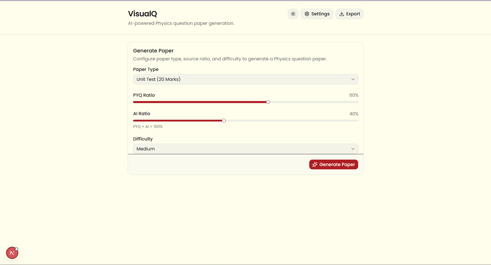
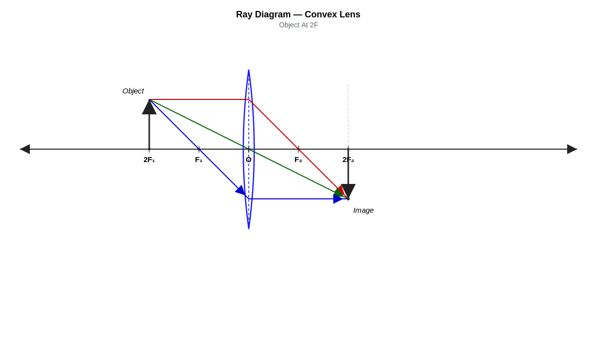
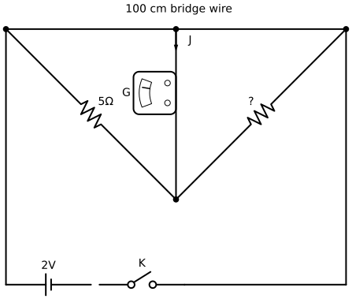
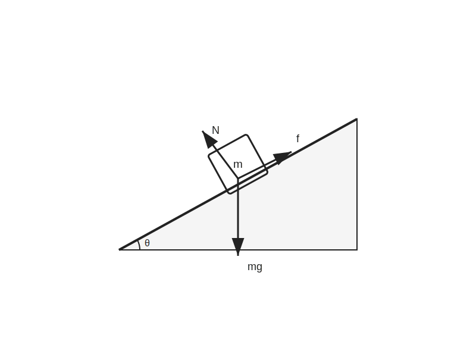
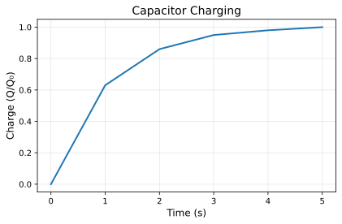
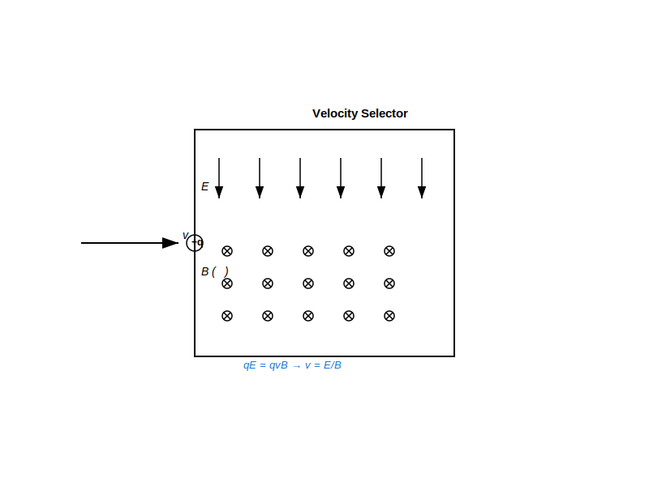
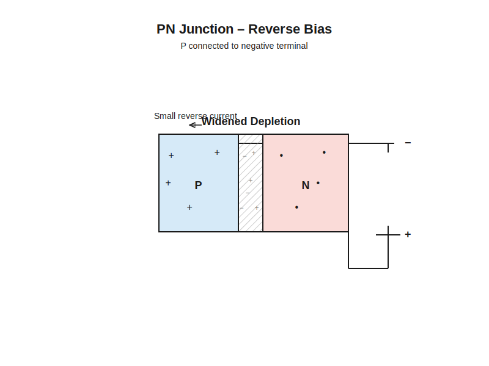

# VisualQ (VQP)

<p align="center">
  
</p>

<p align="center">
  <strong>AI-Powered Physics Question Paper & Diagram Intelligence Engine</strong>
</p>

<p align="center">
  Generate CBSE-compliant Physics question papers, automatically detect diagram-based questions, create accurate SVG diagrams, and export ready-to-use assessments.
</p>

---

## 🚀 Overview

VisualQ is an educational AI platform focused on solving one of the most difficult problems in automated assessment generation:

> Generating Physics question papers along with their required diagrams.

Unlike traditional paper generators, VisualQ contains a dedicated Diagram Intelligence Engine capable of detecting diagram-based questions and generating structured Physics diagrams through deterministic rendering systems.

The platform combines:

* Question Paper Generation
* Diagram Classification
* Diagram Intelligence
* SVG Rendering
* PDF Export
* Diagram Revision Workflows

---

## 🖥️ Interface

<p align="center">
  
</p>

---

## ✨ Key Features

### 📄 Question Paper Generation

* Unit Test (20 Marks)
* Full Paper (70 Marks)
* PYQ + AI Hybrid Generation
* Chapter-based selection
* Difficulty balancing

### 🧠 Diagram Intelligence

Automatic detection of:

* Ray Diagrams
* Circuit Diagrams
* Free Body Diagrams
* Magnetic Field Diagrams
* Semiconductor Diagrams
* Physics Graphs

### 🎨 Deterministic Diagram Rendering

Instead of generating images directly using AI:

Question

↓

Blueprint

↓

Compiler

↓

SVG

Result:

* Consistent output
* Physics accuracy
* Validation support
* Revision support

### 📑 PDF Export

* Printable papers
* Embedded diagrams
* CBSE-style formatting
* Ready for classroom use

---

# 🏗 Architecture

```text
Question

    ↓

Paper Engine

    ↓

Diagram Intelligence Engine

    ↓

Blueprint Generation

    ↓

Validation Layer

    ↓

Compiler System

    ↓

SVG Diagram

    ↓

PDF Export
```

---

# 🔬 Evolution of VisualQ

| Approach     | Description                     | Result                 |
| ------------ | ------------------------------- | ---------------------- |
| Approach 1   | Direct AI Image Generation      | ❌ Rejected             |
| Approach 1.5 | Diagram Knowledge Base Creation | ✅ Foundation           |
| Approach 2   | Schema-Based Representation     | ⚠ Partial Success      |
| Approach 3   | APPROCH2 Compiler System        | ✅ Stable               |
| Approach 3.1 | Example-Based Generation        | ✅ Better Accuracy      |
| Approach 3.2 | Hybrid Generation               | ✅ Current Production   |
| Approach 4   | Diagram Engine V2               | ✅ Current Architecture |
| Approach 5   | Diagram Revision Engine         | 🚧 In Progress         |

---

# 🧩 Diagram Families

| Family                  | Status |
| ----------------------- | ------ |
| Ray Diagrams            | ✅      |
| Circuit Diagrams        | ✅      |
| Free Body Diagrams      | ✅      |
| Magnetic Field Diagrams | ✅      |
| Semiconductor Diagrams  | ✅      |
| Graphs                  | ✅      |

---

# 🎯 Results

<p align="center">
  
  
  
</p>
<p align="center">
  <em>Ray · Circuit · Free Body Diagram</em>
</p>

<p align="center">
  
  
  
</p>
<p align="center">
  <em>Graph · Magnetic Field · Semiconductor</em>
</p>

---

# ⚙️ Tech Stack

## 🖥️ Frontend


## ⚙️ Backend


## 🗄️ Database


## 🤖 AI Models


## 🎨 Diagram Engine


## 🛠️ Development


---

# 🤖 LLM Infrastructure

| Provider              | Model                 | Usage                      | Avg Response Time | Cost Category  | Status           |
| --------------------- | --------------------- | -------------------------- | ----------------- | -------------- | ---------------- |
| OpenRouter            | GPT OSS 120B          | Question Generation        | 5–15 sec          | Low            | ✅ Current        |
| OpenRouter            | GPT OSS 120B          | Blueprint Generation       | 5–20 sec          | Low            | ✅ Current        |
| Google Gemini API     | Gemini 3.5 Flash      | Evaluation & Validation    | 2–8 sec           | Very Low       | ✅ Current        |
| OpenRouter            | Qwen 3 235B Thinking  | Diagram Evaluation         | 15–45 sec         | Medium         | ⚠ Tested         |
| OpenRouter            | DeepSeek R1           | Diagram Reasoning          | 20–60 sec         | Medium–High    | ⚠ Tested         |
| Flux Schnell          | —                     | Diagram Image Research     | 3–10 sec          | Low            | ❌ Discarded      |
| ChatGPT Image Gen     | —                     | Diagram Knowledge Extraction | 10–30 sec       | High           | ⚠ Research Phase |

## 💰 Cost Considerations

### ✅ Current Production Stack

| Stage                  | Provider     |
| ---------------------- | ------------ |
| Question Generation    | GPT OSS 120B (OpenRouter) |
| Blueprint Generation   | GPT OSS 120B (OpenRouter) |
| Evaluation & Validation | Gemini 3.5 Flash |
| Diagram Rendering      | Local SVG Compilers |
| PDF Export             | Local Python Engine |

### 🔻 Why Costs Are Low

VisualQ does **not** generate images using AI image models.

Instead:

```
Question → LLM → Blueprint → SVG Compiler → Diagram
```

Rather than:

```
Question → Image Model → PNG
```

> This removes the most expensive step from the pipeline.

### 📊 Estimated Cost Per Paper

**Unit Test (20 Marks)**

| Stage                  | Cost Source   |
| ---------------------- | ------------- |
| Question Selection     | Local         |
| PYQ Retrieval          | Local         |
| Question Generation    | OpenRouter    |
| Diagram Classification | OpenRouter    |
| Blueprint Generation   | OpenRouter    |
| Evaluation             | Gemini        |
| SVG Rendering          | Local         |
| PDF Export             | Local         |

**Estimated Cost: ₹0 – ₹0.50 per paper**

**Full CBSE Paper (70 Marks)**

| Metric             | Value     |
| ------------------ | --------- |
| Questions          | 30–35     |
| Diagram Questions  | 5–8       |
| LLM Calls          | ~40–60    |
| SVG Compilations   | 5–8       |
| PDF Exports        | 1         |

**Estimated Cost: ₹0.50 – ₹5 per paper**

### 🎯 Cost Optimization Strategy

VisualQ follows a hybrid architecture:

```
OpenRouter → Reasoning & Content Generation
Gemini → Evaluation & Correction
Local Engines → Rendering & Export
```

> This architecture minimizes API usage while maintaining high diagram accuracy and deterministic outputs.

### 📌 Summary

> VisualQ reduces generation costs by using LLMs only for reasoning and blueprint creation, while all diagram rendering and PDF generation are executed locally through deterministic engines. This significantly lowers operational costs compared to AI image generation workflows.

---

# 📂 Project Structure

```text
VQP/

├── frontend/
│
├── backend/
│
├── backend_v2/
│
├── approch2/
│   ├── ray/
│   ├── circuit/
│   ├── fbd/
│   ├── magnetic/
│   ├── semiconductor/
│   └── graph/
│
├── datapipeline/
│
└── approaches/
```

---

# 📊 Current Status

---

# 🎯 Design Principle

VisualQ follows a simple rule:

```text
LLM

↓

Blueprint

↓

Deterministic Renderer

↓

SVG
```

Never:

```text
LLM

↓

Raw Diagram
```

The renderer is the source of truth.

The AI only provides structured intent.

---

# 👨‍💻 Authors

Built as part of the VisualQ research initiative focused on Physics Question Paper Generation, Diagram Intelligence, and Educational AI Systems.

---

## License

Research & Educational Use.
