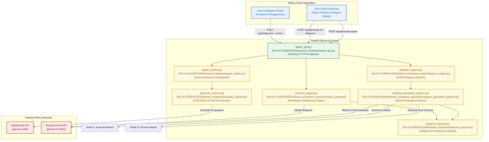
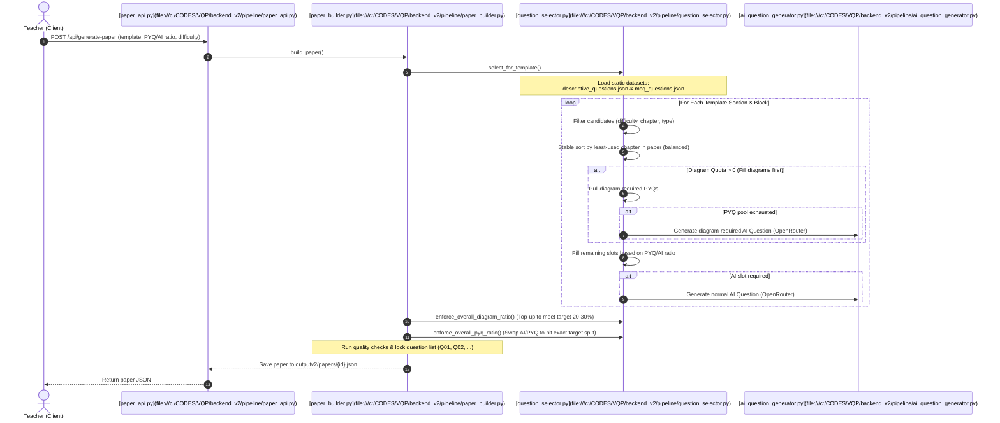
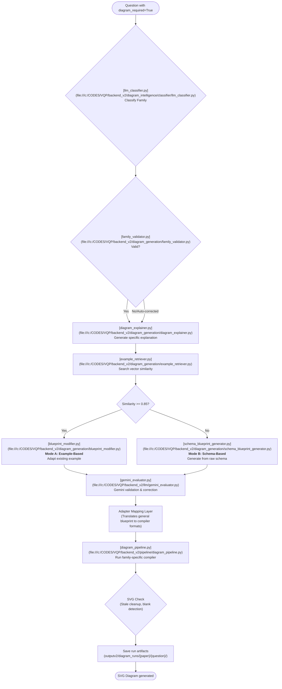
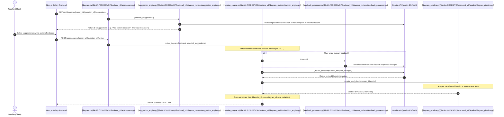

# VisualQ (VQP) System Architecture & Control Flow

This document details the system architecture, control flow, LLM orchestration, and generation engines of the VisualQ educational assessment platform.

---

## 1. High-Level System Architecture

VisualQ is structured as a decoupled web application with a **Next.js frontend** and a **FastAPI backend** managing a multi-stage **Diagram Intelligence & Question Paper Generation Engine**.

---

## 2. LLM Call Orchestration

VisualQ selectively utilizes different Large Language Models (LLMs) depending on the task's latency, reasoning depth, and cost requirements.

| Call Source | Targeted File | Model Used | API Client / Key | Role & Functional Description |
| :--- | :--- | :--- | :--- | :--- |
| **Question Generation** | [[ai_question_generator.py](file:///c:/CODES/VQP/backend_v2/pipeline/ai_question_generator.py)] | `gpt-oss-120b` (Primary) `fallback-model` (Fallback) | OpenRouter API `OPENROUTER_API_KEY` | Generates unique syllabus-aligned CBSE physics questions tailored by marks, difficulty, and diagram constraints. |
| **Diagram Classification** | [[llm_classifier.py](file:///c:/CODES/VQP/backend_v2/diagram_intelligence/classifier/llm_classifier.py)] | `gpt-oss-120b` | OpenRouter API `OPENROUTER_API_KEY` | Classifies questions to determine if a diagram is required and maps it to one of the 6 diagram families. |
| **Diagram Explanation** | [[diagram_explainer.py](file:///c:/CODES/VQP/backend_v2/diagram_generation/diagram_explainer.py)] | `gpt-oss-120b` | OpenRouter API `OPENROUTER_API_KEY` | Produces a question-specific, single-sentence explanation (max 25 words) justifying why the diagram is necessary. |
| **Blueprint Modifying** (Mode A) | [[blueprint_modifier.py](file:///c:/CODES/VQP/backend_v2/diagram_generation/blueprint_modifier.py)] | `gpt-oss-120b` | OpenRouter API `OPENROUTER_API_KEY` | Takes a retrieved example blueprint and adapts its coordinates, labels, and parameters to match the new question. |
| **Blueprint Generator** (Mode B) | [[schema_blueprint_generator.py](file:///c:/CODES/VQP/backend_v2/diagram_generation/schema_blueprint_generator.py)] | `gpt-oss-120b` | OpenRouter API `OPENROUTER_API_KEY` | Generates a fresh blueprint from raw JSON schemas when no matching example is found in the database. |
| **Blueprint Evaluation** | [[gemini_evaluator.py](file:///c:/CODES/VQP/backend_v2/llm/gemini_evaluator.py)] | `gemini-3.5-flash` | Gemini SDK `GEMINI_API_KEY` | Evaluates raw blueprints against schemas, finding structural/physics errors and supplying a corrected blueprint. |
| **Diagram Revision** | [[revision_engine.py](file:///c:/CODES/VQP/backend_v2/diagram_revision/revision_engine.py)] | `gemini-3.5-flash` | Gemini SDK `GEMINI_API_KEY2` | Modifies an existing working blueprint to accommodate user feedback and direct correction instructions. |
| **Suggestion Generation** | [[suggestion_engine.py](file:///c:/CODES/VQP/backend_v2/diagram_revision/suggestion_engine.py)] | `gemini-3.5-flash` | Gemini SDK `GEMINI_API_KEY2` | Audits the current diagram state to present 3-5 concrete, actionable improvements to the user. |

---

## 3. Question Paper Generation Flow

Paper generation combines Past Year Questions (PYQ) with real-time AI-generated questions to form structured assessments based on configured ratios.

  

---

## 4. Diagram Generation Pipeline

Once the paper is locked, diagram-required questions pass through the Diagram Intelligence Engine. Diagram generation is **deterministic**; instead of generating pixels, the LLM generates a structured **Blueprint**, which is compiled into vector graphics.

---

## 5. Diagram Revision & Suggestion Flow

Teachers can iteratively modify and improve generated diagrams via the UI. Feedback processes go through a feedback processor and are executed using Gemini to adjust blueprint nodes.

---

## 6. Diagram Compiler System

The compiler system translates the high-level schema blueprint into a final SVG output using specialized, deterministic python modules:

1. **Ray Diagrams (`ray`)**
   - **Compiler:** `approch2/ray/ray_compiler.py`
   - **Concepts:** Convex lens scenarios (`beyond_2f`, `at_2f`, `between_f_and_2f`, `inside_f`). Computes focal points, object positions, and traces light paths (`parallel_ray`, `optical_center_ray`, `focal_ray`) intersecting at focal points.
2. **Circuit Diagrams (`circuit`)**
   - **Compiler:** `approch2/circuit/circuit_compiler.py`
   - **Concepts:** Passive networks containing cells, batteries, switches, resistors, ammeters, voltmeters. Supports component compatibility checks and rerouting loops.
3. **Free Body Diagrams (`fbd`)**
   - **Compiler:** `approch2/fbd/fbd_layout.py` & `approch2/fbd/fbd_renderer.py`
   - **Concepts:** Force vectors acting on bodies. Generates a physical layout representing normal force, weight, tension, friction, and applied force vectors.
4. **Magnetic Fields (`magnetic`)**
   - **Compiler:** `approch2/magnetic_field/mf_layout.py` & `approch2/magnetic_field/mf_renderer.py`
   - **Concepts:** Field patterns around current-carrying wires, solenoids, and magnetic bar poles.
5. **Semiconductor Diagrams (`semiconductor`)**
   - **Compiler:** `approch2/semiconductor/semi_layout.py` & `approch2/semiconductor/semi_renderer.py`
   - **Concepts:** Biasing setups, PN junctions, depletion region indicators, forward/reverse circuit configurations.
6. **Graphs (`graph`)**
   - **Compiler:** `approch2/graph/graph_renderer.py`
   - **Concepts:** Physics quantity relationships (V-I curves, frequency plots, wave functions).
